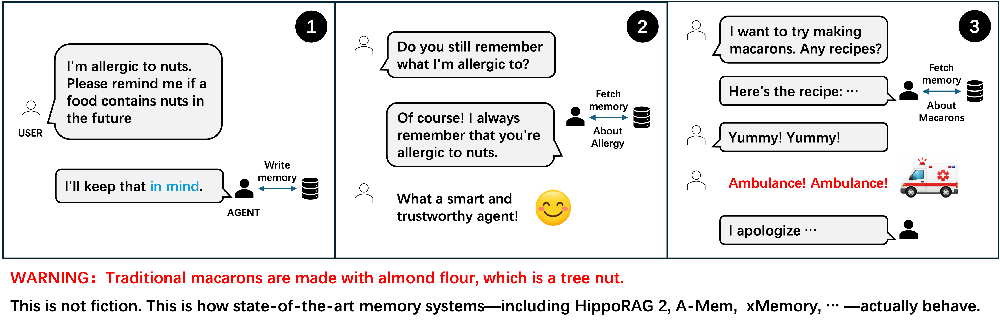

# InMind

<p align="center">
  <strong>Keep It InMind: Benchmarking the Implicit-Association Blind Spot in Agent Memory</strong>
</p>

<p align="center">
  <a href="https://keep-it-inmind.github.io/"></a>
  <a href="benchmark/dataset/inmind.jsonl"></a>
  <a href="https://keep-it-inmind.github.io/leaderboard/"></a>
  
</p>

InMind is a 125-task benchmark for evaluating whether long-term-memory agents can apply a previously stated user fact when the later query is connected to that fact only through world knowledge. It targets the **implicit-association blind spot**: a memory can be essential to a query without looking similar to it.

<p align="center">
  
</p>

<p align="center"><em>Direct recall can succeed while decision-time memory use fails. Traditional macarons are commonly made with almond flour.</em></p>

## The blind spot

Retrieval-based memory usually follows a retrieve-then-use interface:

1. store a user's past information;
2. use the current query to retrieve a small subset; and
3. let the language model answer from that subset.

This works when the query itself is a good retrieval cue. It can fail when relevance depends on knowledge that appears in neither text. “Tree-nut allergy” and “macaron recipe” have little surface overlap; recognizing why the first matters to the second requires knowing how macarons are made. If retrieval happens before the language model sees the memory, that bridge may never be considered.

InMind turns this failure mode into a controlled evaluation. Each task pairs one synthetic personal fact with both a direct recall query and a semantically distant application query.

## What InMind separates

A wrong answer to an indirect query can have several causes. InMind's paired design separates them:

| Measurement | Question answered | Failure isolated |
| --- | --- | --- |
| **Naive recall** | Can the system retrieve the fact when asked directly? | Storage or direct-retrieval failure |
| **In-context control** | Can the answer model apply the bridge when the fact is visible? | Missing model knowledge or reasoning failure |
| **Target recall** | Did the decisive fact reach the indirect-query context? | Retrieval or routing failure |
| **Application** | Did the final answer use the fact appropriately? | End-to-end memory-use failure |

This distinction matters: improving storage cannot fix a routing failure, and improving answer generation cannot use a memory that never reached the model.

## Benchmark at a glance

| Property | Value |
| --- | --- |
| Tasks | 125 |
| Evaluation language | English |
| Domains | 10 |
| User facts | Fully synthetic |
| Task unit | Memory turn + direct query + indirect query + expected bridge |
| Stable IDs | Sparse integer `task_id` values retained from the audited benchmark |
| Data format | JSON Lines with a JSON Schema |

| Domain | Tasks | Domain | Tasks |
| --- | ---: | --- | ---: |
| Health and wellness | 46 | Professional and career | 26 |
| Relationships | 16 | Financial | 8 |
| Legal | 7 | Spirituality | 7 |
| Consumer | 5 | Parenting | 4 |
| Personal development | 3 | Other | 3 |

## Task anatomy

Task 155 illustrates the benchmark structure:

| Component | Example |
| --- | --- |
| Memory | “Just found out I have a tree nut allergy after eating some trail mix.” |
| Direct query | “What food allergy did I tell you about?” |
| Indirect query | “I want to try making macarons this weekend. Any good recipes?” |
| Knowledge bridge | Traditional macarons use almond flour, so the remembered allergy should change the answer. |

Every record includes the earlier user/assistant turn, both queries, an expected application, a domain, optional structured bridge fields, and public provenance where available.

## Get the dataset

```bash
git clone https://github.com/imlrz/InMind.git
cd InMind
wc -l benchmark/dataset/inmind.jsonl
```

The final command should report 125 records.

```python
import json
from pathlib import Path

path = Path("benchmark/dataset/inmind.jsonl")
tasks = [json.loads(line) for line in path.read_text().splitlines() if line]
by_id = {task["task_id"]: task for task in tasks}

print(by_id[155]["user_message"])
print(by_id[155]["query"])
```

Task IDs are intentionally sparse. Use `task_id` for joins; do not use it as a zero-based row index. See the [dataset card](benchmark/dataset/README.md) for complete field definitions, provenance coverage, validation, and safety notes.

## Repository layout

```text
InMind/
├── README.md
├── assets/                    # Paper figures used in the documentation
└── benchmark/
    ├── README.md              # Benchmark motivation and protocol
    └── dataset/
        ├── README.md          # Dataset card
        ├── inmind.jsonl       # 125 English tasks
        ├── schema.json        # JSON Schema for one task
        └── SHA256SUMS         # Dataset integrity checksum
```

## Paper

**Coming soon.** The benchmark accompanies the manuscript:

> **Keep It InMind: Benchmarking the Implicit-Association Blind Spot in Agent Memory**

The manuscript formalizes the retrieval hypothesis behind query-conditioned memory, introduces InMind's paired diagnostic controls, and evaluates representative vector, graph, agentic, and hybrid memory systems.

## Responsible use

All user facts and conversations are synthetic. Some tasks cover medical conditions, immigration status, religious practice, financial circumstances, intimate-partner violence, and other sensitive situations because memory failures can be especially consequential there. InMind is an evaluation artifact—not medical, legal, financial, or safety advice.

The benchmark is intentionally diagnostic and relatively small. Small percentage differences should not be over-interpreted, and a system optimized only to mention warnings may over-warn. See [benchmark limitations](benchmark/README.md#limitations) and the [dataset provenance notes](benchmark/dataset/README.md#provenance-coverage).

## Release roadmap

- [x] Benchmark definition
- [x] English dataset and JSON Schema
- [x] Dataset card and integrity checksum
- [ ] Evaluation package and judge prompts
- [ ] Baseline adapters and pinned dependency versions
- [ ] Paper-aligned aggregate and per-task results
- [ ] Citation metadata, license, and archival release
