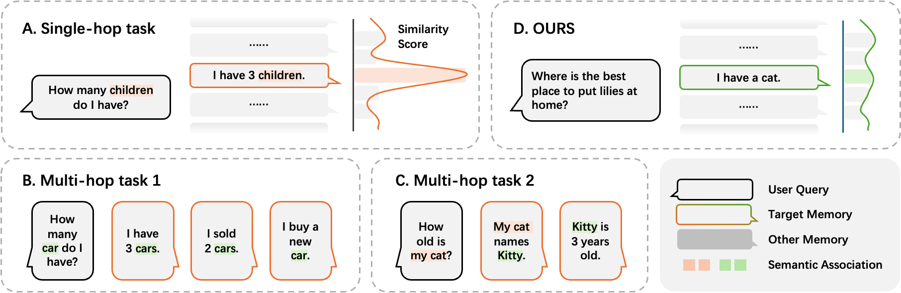
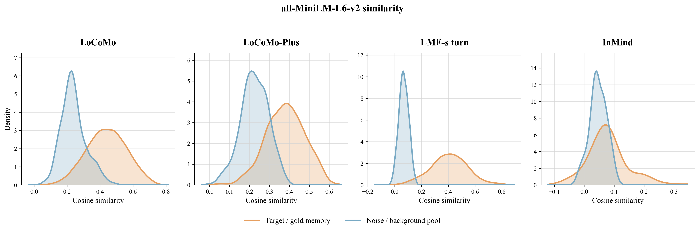

# InMind benchmark

InMind evaluates **knowledge-mediated application of explicit user facts**. It asks whether a memory system can surface a fact when the fact's relevance to the current query is created by world knowledge rather than by lexical, topical, or embedding similarity.

<p align="center">
  
</p>

<p align="center"><em>InMind differs from explicit recall, state aggregation, and conversational multi-hop tasks: the bridge between memory and query is external knowledge, not another conversational fact.</em></p>

## Problem formulation

Let `m` be a stored personal memory, `q` a later query, and `k` a background-knowledge bridge. An InMind task is designed so that:

1. **Necessity:** `m` changes what a safe, correct, or appropriately personalized answer to `q` should say.
2. **Semantic distance:** `m` and `q` do not provide an obvious lexical or topical retrieval cue.
3. **Knowledge bridge:** background knowledge `k` connects the two, `m → k → q`.

For example, “I have a cat” should affect a later question about placing lilies at home because lilies are toxic to cats. The conversation never states that bridge; a capable model may know it, but a query-conditioned retriever must decide which memory is relevant before the model sees that memory.

This ordering is the central object of study:

```text
query → retrieval/routing → selected memories → language-model reasoning → answer
```

If the decisive fact is filtered out at the retrieval step, stronger downstream reasoning cannot recover it.

## Task structure

Every task contains one synthetic memory turn and two later queries:

| Field | Role |
| --- | --- |
| `user_message` | Personal fact introduced into memory |
| `assistant_message` | Natural acknowledgement paired with the memory turn |
| `naive_query` | Direct query that explicitly cues the stored fact |
| `query` | Indirect query whose answer should change because of the fact |
| `explanation` | Expected application and the knowledge bridge used for evaluation |
| `entity_1`, `entity_2`, `relation` | Optional structured description of the bridge |
| `domain` | One of the benchmark's ten life domains |
| `provenance` | Build origin and optional public source trace |

The optional structured bridge fields are absent for some tasks retained from the original 90-task set; `explanation` is present for all 125 tasks.

## Diagnostic evaluation

InMind is designed to avoid treating every wrong indirect answer as the same kind of memory failure.

### 1. Naive recall

The direct `naive_query` asks for the stored fact explicitly. A correct response shows that the fact was written and can be retrieved when the query supplies a clear cue.

### 2. In-context control

The target memory is placed directly in the answer model's context before the indirect query. This tests whether the model has the knowledge and reasoning ability required to connect the memory to the query once both are visible.

### 3. Target recall

An answer-blind judge checks whether the target personal fact is present in the context actually supplied to the answer model for the indirect query. It does not inspect the generated answer. This isolates retrieval or routing.

### 4. Application

An answer-level judge checks whether the final response applies the expected bridge. In the complete protocol, application should be interpreted alongside target recall so that a generic warning generated from world knowledge is not automatically credited as successful memory use.

| Observed outcome | Likely diagnosis |
| --- | --- |
| Naive recall fails | Storage or direct-retrieval failure |
| Naive succeeds, target recall fails | Query-time retrieval/routing failure |
| Target recall succeeds, application fails | Answer utilization or reasoning failure |
| In-context control fails | Task/model knowledge mismatch |

## Why similarity is not enough

In common memory benchmarks, target memories tend to be more similar to the query than background memories. InMind is constructed to suppress that signal: the target-memory and background distributions substantially overlap under an independently selected embedding model.

<p align="center">
  
</p>

<p align="center"><em>Target/gold memories are orange; noise/background memories are blue. InMind deliberately reduces target–background separation.</em></p>

The figure is a diagnostic, not a claim that every possible retriever must fail. A sufficiently expensive world-model-based relevance function could discover the bridge, but it would no longer be ordinary similarity retrieval. InMind measures how current memory interfaces behave in this gap.

## Construction principles

The released set was assembled around four requirements:

1. **Decision relevance:** omitting the memory must materially change the expected answer.
2. **Verifiable bridge:** the connection should rest on checkable background knowledge rather than personal taste alone.
3. **Low direct cueing:** the indirect query should not simply name or paraphrase the stored fact.
4. **Paired diagnosis:** every task must include a direct recall query and an indirect application query.

Candidates underwent annotation, similarity filtering, and conflict review. The 125-task public set corresponds to the internally audited `final-v6a` build, with hard-conflict tasks removed. Internal paths, raw API usage, and model-service metadata are excluded from the public release.

## Dataset composition

| Domain | Count | Share |
| --- | ---: | ---: |
| `consumer` | 5 | 4.0% |
| `financial` | 8 | 6.4% |
| `health_and_wellness` | 46 | 36.8% |
| `legal` | 7 | 5.6% |
| `other` | 3 | 2.4% |
| `parenting` | 4 | 3.2% |
| `personal_development` | 3 | 2.4% |
| `professional_and_career` | 26 | 20.8% |
| `relationships` | 16 | 12.8% |
| `spirituality` | 7 | 5.6% |

The task mix follows settings in which persistent assistants often give consequential personal guidance. Health, wellness, professional, and relationship scenarios are intentionally prominent.

## Stable identifiers

The public `task_id` values are sparse and stable. They preserve identifiers used by the manuscript and experiment records—for example, the tree-nut-allergy/macaron example is Task 155. Consumers must not assume IDs are contiguous or use them as zero-based row positions.

## Intended use

InMind is intended for:

- evaluating long-term-memory retrieval and routing;
- comparing direct recall with knowledge-mediated application;
- diagnosing whether a failure occurred before or after the model received the relevant fact;
- studying hybrid retrieval and always-visible memory designs; and
- testing relevance functions that incorporate world knowledge.

It is not intended as a knowledge base, a source of professional advice, or a standalone benchmark of medical or legal correctness.

## Limitations

- The benchmark contains 125 tasks, so small percentage differences are sampling-sensitive.
- Health, wellness, and safety scenarios are overrepresented by design.
- Some real-world bridges are probabilistic, jurisdiction-dependent, or context-sensitive even when the benchmark expectation is binary.
- Public source provenance is incomplete for tasks retained from the original 90-task set and for some human-curated tasks.
- The current release has positive application cases but no matched negative controls, so it does not directly penalize systematic over-warning.
- Results can depend on the answer model, judge model, prompt, memory-write policy, retrieval budget, and injection timeline; these must be reported together.

See the [dataset card](dataset/README.md) for file format, provenance coverage, and safety notes.

## Run the benchmark

Use the repository's [evaluation package](../evaluation/README.md) for the fixed LME-s background, canonical target-injection timeline, answer and judge prompts, result schema, and validation scripts. Coding agents can follow the [`evaluate-inmind` skill](../skills/evaluate-inmind/SKILL.md).
